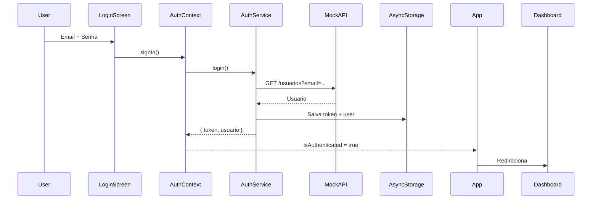

# 📱 Work360 - Sistema de Gestão de Produtividade Corporativa

> Aplicativo móvel profissional para gestão de tarefas, reuniões, analytics e insights de produtividade com suporte a IoT e IA.

[](https://reactnative.dev/)
[](https://expo.dev/)
[](https://www.typescriptlang.org/)
[](LICENSE)

---

## 🎯 Sobre o Projeto

Work360 é um aplicativo mobile corporativo desenvolvido com **arquitetura profissional em camadas**, seguindo princípios SOLID e Clean Architecture. O projeto utiliza MockAPI como backend temporário enquanto o backend Java (Spring Boot) está sendo finalizado, permitindo desenvolvimento paralelo e entrega contínua.

### ✨ Principais Funcionalidades

- 🔐 **Autenticação JWT** - Login e registro com gerenciamento seguro de sessão
- ✅ **Gestão de Tarefas** - CRUD completo com prioridades e status
- 📅 **Gestão de Reuniões** - Agendamento e controle de reuniões
- 📊 **Analytics em Tempo Real** - Métricas de produtividade e foco
- 🤖 **IA Generativa** - Classificação inteligente e recomendações
- 📱 **IoT Integration** - Dados de sensores (batimentos, ruído, foco)
- 📈 **Relatórios Inteligentes** - Insights automáticos de performance
- 🎨 **UI/UX Profissional** - Design moderno e responsivo

---

## 🏗️ Arquitetura

```
┌─────────────────────────────────────────────────┐
│            PRESENTATION LAYER                   │
│  (Screens, Components, Navigation)              │
└───────────────┬─────────────────────────────────┘
                │
┌───────────────▼─────────────────────────────────┐
│         STATE MANAGEMENT LAYER                  │
│           (Context API)                         │
└───────────────┬─────────────────────────────────┘
                │
┌───────────────▼─────────────────────────────────┐
│         BUSINESS LOGIC LAYER                    │
│           (Services)                            │
└───────────────┬─────────────────────────────────┘
                │
┌───────────────▼─────────────────────────────────┐
│            DATA LAYER                           │
│      (API, AsyncStorage)                        │
└─────────────────────────────────────────────────┘
```

### 📁 Estrutura de Pastas

```
work360/
├── app/                    # Rotas Expo Router
│   ├── (tabs)/            # Navegação principal
│   ├── index.tsx          # Roteamento inicial
│   ├── login.tsx          # Tela de login
│   └── register.tsx       # Tela de cadastro
│
├── src/
│   ├── components/        # Componentes reutilizáveis
│   ├── contexts/          # Gerenciamento de estado
│   ├── screens/           # Telas da aplicação
│   ├── services/          # Camada de serviços
│   ├── styles/            # Temas e estilos
│   ├── types/             # Definições TypeScript
│   └── utils/             # Utilitários
│
├── MOCKAPI_SETUP.md       # Guia completo do MockAPI
├── ARQUITETURA.md         # Documentação técnica
└── README.md
```

---

## 🚀 Começando

### Pré-requisitos

- Node.js 18+
- npm ou yarn
- Expo CLI
- Conta no MockAPI.io

### Instalação

1. **Clone o repositório**
```bash
git clone https://github.com/seu-usuario/work360.git
cd work360
```

2. **Instale as dependências**
```bash
npm install
```

3. **Configure o MockAPI**
- Siga as instruções em [MOCKAPI_SETUP.md](MOCKAPI_SETUP.md)
- Configure a URL no arquivo `src/services/api.ts`

4. **Inicie o aplicativo**
```bash
npm run dev
```

5. **Abra no dispositivo**
- Escaneie o QR code com Expo Go
- Ou pressione `w` para abrir no navegador

---

## 📚 Documentação Completa

- **[MOCKAPI_SETUP.md](MOCKAPI_SETUP.md)** - Guia completo de configuração do MockAPI com todos os JSONs
- **[ARQUITETURA.md](ARQUITETURA.md)** - Documentação técnica detalhada da arquitetura

---

## 🛠️ Tecnologias

### Core
- **React Native 0.81.4** - Framework mobile multiplataforma
- **Expo SDK 54** - Plataforma de desenvolvimento
- **TypeScript 5.9** - Tipagem estática

### Navegação
- **Expo Router 6** - Roteamento baseado em arquivos
- **React Navigation 7** - Navegação nativa

### Backend & API
- **Axios 1.13** - Cliente HTTP com interceptors
- **MockAPI.io** - Backend temporário REST

### Estado & Persistência
- **React Context API** - Gerenciamento de estado global
- **AsyncStorage 2.2** - Persistência local segura

### UI/UX
- **Lucide React Native** - Biblioteca de ícones moderna
- **StyleSheet API** - Estilização nativa otimizada

---

## 📊 Endpoints da API

### Autenticação (Mock)
```typescript
POST /usuarios              # Registro
GET  /usuarios?email=...    # Login (simulado)
```

### Tarefas
```typescript
GET    /tarefas?usuario_id={id}
POST   /tarefas
PUT    /tarefas/{id}
DELETE /tarefas/{id}
```

### Reuniões
```typescript
GET    /reunioes?usuario_id={id}
POST   /reunioes
PUT    /reunioes/{id}
DELETE /reunioes/{id}
```

### Analytics
```typescript
POST /analytics/eventos
GET  /analytics/metricas?usuario_id={id}
GET  /analytics/metricas?usuario_id={id}&data={date}
```

### Relatórios & IA
```typescript
GET  /relatorios?usuario_id={id}
POST /ia/classificar-tarefa
POST /ia/produtividade
POST /ia/resumo
```

### IoT
```typescript
POST /iot/sensordata
GET  /iot/sensordata?usuarioId={id}
```

---

## 🎨 Telas Principais

### 🔐 Autenticação
- **Login** - Email/senha com validação
- **Registro** - Criação de conta

### 📱 Dashboard
- Resumo de métricas do dia
- Tarefas pendentes
- Próximas reuniões
- Minutos de foco

### ✅ Tarefas
- Listagem com filtros (Todas, Pendentes, Em Progresso, Concluídas)
- Criação e edição
- Marcação de conclusão
- Indicadores de prioridade

### 📅 Reuniões
- Listagem de reuniões
- Criação com link e horário
- Visualização de detalhes

### 📊 Analytics
- Métricas de produtividade
- Gráficos de evolução
- Períodos mais produtivos

### 👤 Perfil
- Informações do usuário
- Logout

---

## 🔄 Fluxo de Autenticação



---

## 🧪 Testes (Preparado)

O projeto está estruturado para implementação de testes:

```bash
# Estrutura sugerida
npm install --save-dev jest @testing-library/react-native

# Exemplos de testes
src/services/__tests__/taskService.test.ts
src/components/__tests__/Button.test.tsx
src/screens/__tests__/LoginScreen.test.tsx
```

---

## 🚀 Deploy

### Web (Expo)
```bash
npm run build:web
```

### Mobile (EAS Build)
```bash
npm install -g eas-cli
eas build --platform android
eas build --platform ios
```

---

## 🔧 Migração para Backend Real

Quando o backend Java estiver pronto:

1. **Atualizar URL da API**
```typescript
// src/services/api.ts
const API_BASE_URL = 'https://seu-backend.com/api/v1';
```

2. **Ajustar endpoints de autenticação**
```typescript
// Trocar simulação por endpoints reais
POST /auth/login
POST /auth/register
GET  /auth/me
```

3. **Validar tipagens**
- Ajustar interfaces TypeScript se necessário
- Atualizar tratamento de erros

4. **Testar integração**
- Validar todos os fluxos
- Verificar tokens JWT reais

---

## 📝 Scripts Disponíveis

```bash
npm run dev          # Inicia o Expo
npm run build:web    # Build para web
npm run lint         # Lint do código
npm run typecheck    # Verificação de tipos
```

---

## 🤝 Contribuindo

1. Fork o projeto
2. Crie uma branch (`git checkout -b feature/AmazingFeature`)
3. Commit suas mudanças (`git commit -m 'Add some AmazingFeature'`)
4. Push para a branch (`git push origin feature/AmazingFeature`)
5. Abra um Pull Request

---

## 📄 Licença

Este projeto está sob a licença MIT. Veja o arquivo [LICENSE](LICENSE) para mais detalhes.

---

## 👥 Equipe

- **Desenvolvimento Mobile** - React Native + Expo
- **Backend** - Java Spring Boot (em desenvolvimento)
- **Design** - UI/UX Profissional

---

## 📞 Contato

- **Projeto FIAP** - Sistema de Gestão de Produtividade
- **Repositório** - [GitHub](https://github.com/seu-usuario/work360)

---

## 🎯 Roadmap

### ✅ Fase 1 - MVP (Concluída)
- [x] Autenticação
- [x] CRUD de Tarefas
- [x] CRUD de Reuniões
- [x] Dashboard
- [x] Navegação por tabs

### 🚧 Fase 2 - Analytics (Em Progresso)
- [x] Serviços de analytics
- [ ] Gráficos interativos
- [ ] FocusMode com timer
- [ ] Notificações

### 📋 Fase 3 - IA e IoT
- [ ] Integração IoT real
- [ ] Recomendações de IA
- [ ] Análise preditiva
- [ ] Gamificação

### 🚀 Fase 4 - Produção
- [ ] Testes unitários completos
- [ ] Testes E2E
- [ ] CI/CD pipeline
- [ ] Deploy em produção

---

## 📸 Screenshots

*Screenshots serão adicionados após implementação completa da UI*

---

## ⚡ Performance

- Bundle size otimizado
- Lazy loading de componentes
- Memoização de cálculos pesados
- Cache de requisições
- Imagens otimizadas

---

## 🔒 Segurança

- Tokens JWT armazenados de forma segura
- Validação de formulários
- Sanitização de inputs
- Tratamento de sessões expiradas
- HTTPS obrigatório em produção

---

## 💡 Boas Práticas

- ✅ Tipagem forte com TypeScript
- ✅ Componentização reutilizável
- ✅ Separação de responsabilidades
- ✅ Clean Architecture
- ✅ SOLID principles
- ✅ Código documentado
- ✅ Commits semânticos

---

**Work360** - Transformando produtividade em resultados 🚀

*Desenvolvido com ❤️ para FIAP*
